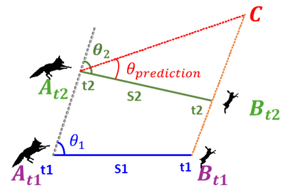
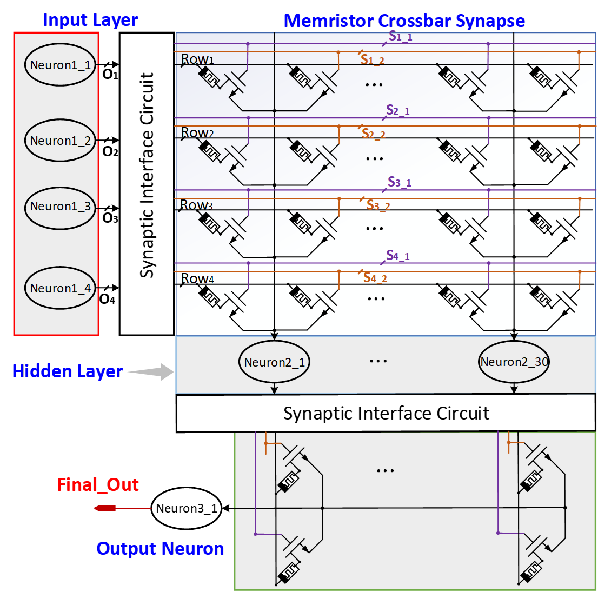
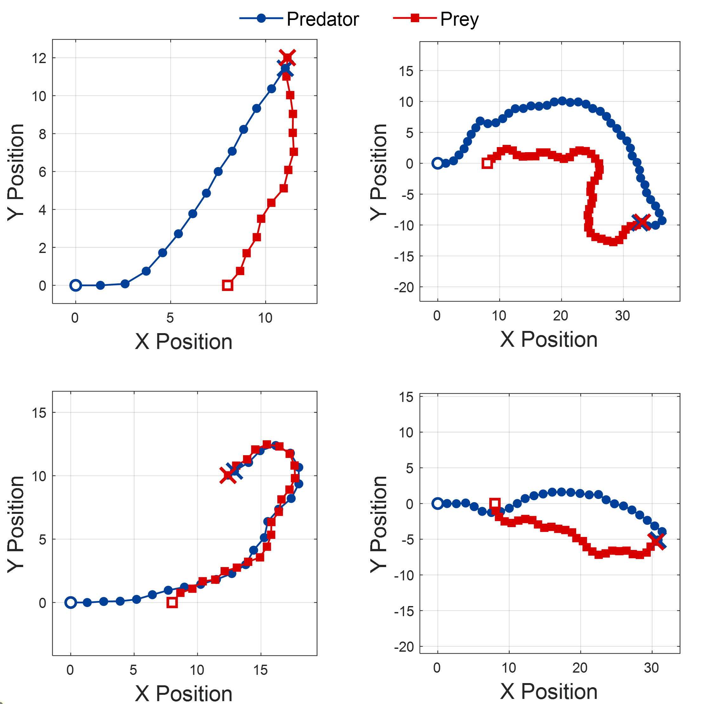
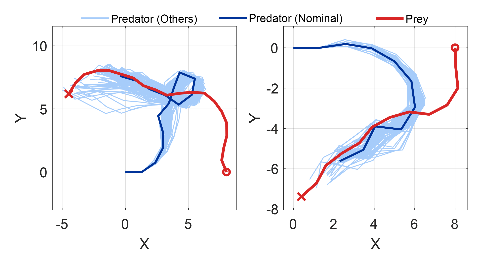
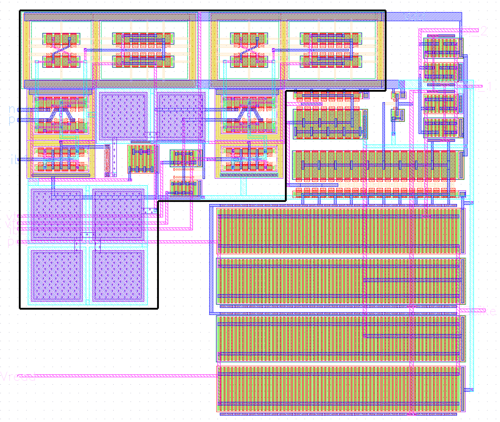

# Memristor-Based Spiking Neural Network Accelerator

Curated public research-code release for the memristor-based spiking neural-network accelerator for bio-inspired interception tasks.

This repository provides organized MATLAB scripts, Verilog-A model files, sanitized Spectre workflow templates, selected public figures, and documentation for understanding the project workflow. Full circuit-level simulation requires an external Cadence/Spectre environment and the corresponding 130 nm PDK/ODK, which are not included due to licensing restrictions.

Repository URL:

<https://github.com/QQH-code/Memristor-Based-Spiking-Neural-Network-Accelerator-for-Bio-inspired-Interception-Task>

## Project Overview

### Bio-inspired interception task



### Memristor-based SNN accelerator architecture



### System-level results





### Neuron layout



## Associated Papers

Please cite both related papers if you use this repository, its workflow templates, figures, or ideas:

- Qianhou Qu, Sheng Lu, Sungyong Jung, Qilian Liang, and Chenyun Pan, "Compact and Energy-Efficient Memristive Spiking Neuromorphic Accelerator for Bio-inspired Interception Tasks," arXiv:2605.31141, 2026.
- Qianhou Qu, Sheng Lu, Liuting Shang, Jaihan Utailawon, Sungyong Jung, Qilian Liang, and Chenyun Pan, "Memristor-Based Spiking Neural Network Accelerator for Bio-inspired Interception Task," arXiv:2605.31299, 2026.

Machine-readable citation metadata is provided in [CITATION.cff](CITATION.cff).

## Repository Contents

```text
src/matlab/
  MATLAB scripts used for SNN, crossbar, neuron, mapping, waveform-processing,
  and result-analysis workflows.

src/veriloga/
  Verilog-A model files used in the research workflow. These files are provided
  for reference and simulation-template purposes.

src/data_examples/
  Small public example CSV/data files that are safe to include.

spectre_templates/
  Sanitized Spectre netlist and run-script templates. These require an external
  Cadence/Spectre installation and a properly configured 130 nm PDK/ODK environment.

figures/paper_figures/
  Manually curated public figures associated with the project. Private notes,
  local paths, and unrelated project figures are excluded.

docs/
  Documentation explaining the project flow, external dependencies, Spectre workflow,
  figure descriptions, and citation information.

audit/
  Source-to-public file map, figure inventory, and public repository audit records.

tests/
  Lightweight repository-integrity checks. These tests do not generate artificial
  scientific results.
```

## How to Read This Repository

Start with:

- [docs/overview.md](docs/overview.md) for the high-level project scope.
- [docs/project_flow.md](docs/project_flow.md) for how the MATLAB, Verilog-A, and Spectre workflow pieces relate.
- [docs/spectre_simulation_workflow.md](docs/spectre_simulation_workflow.md) for external circuit-simulation requirements.
- [docs/figure_description.md](docs/figure_description.md) for the included public figure inventory.
- [REPOSITORY_PREPARATION_REPORT.md](REPOSITORY_PREPARATION_REPORT.md) for the release-curation and privacy-audit summary.

The MATLAB and Spectre-related files reflect the original research workflow, but some scripts expect generated simulator outputs or local tool configuration that are not part of this public repository.

## External Cadence/Spectre and PDK/ODK Requirements

Full circuit-level simulation requires external resources that are not included:

- Cadence Spectre
- a valid Cadence license
- a properly configured 130 nm PDK/ODK environment
- local model-library paths
- generated netlists and simulator output directories

The public templates use placeholders such as `$SPECTRE_BIN`, `$PDK_ROOT`, `$SPECTRE_MODEL_DIR`, and `$CADENCE_HOME`.

## What Is Included

- Selected MATLAB scripts for software/circuit workflow analysis.
- Verilog-A device/model files used by the research flow.
- Small public CSV examples.
- Sanitized Spectre templates with placeholders instead of private paths.
- Manually curated public figures associated with the project.
- Documentation and audit files for public release preparation.

## What Is Not Included

- Full paper PDF.
- Full PowerPoint slide deck.
- PDK/ODK technology files.
- Cadence installation files, license files, or environment files.
- Raw Spectre outputs, logs, `.print` files, or simulator run directories.
- MATLAB binary artifacts such as `.mat` and `.fig`.
- Private paths, server paths, personal emails, or local setup files.

## Integrity Check

Run the repository-integrity check:

```bash
python tests/smoke_test.py
```

This check only verifies the public release structure and excluded-artifact rules. It does not run circuit simulations.

## License

This repository is released under the MIT License. See [LICENSE](LICENSE) for details.

## Disclaimer

This repository is a curated public code/documentation release associated with the related research papers. It is not a complete end-to-end circuit reproduction package. Proprietary simulator files, PDK/ODK files, and licensed Cadence/Spectre resources must be supplied by users through their own authorized environment.
